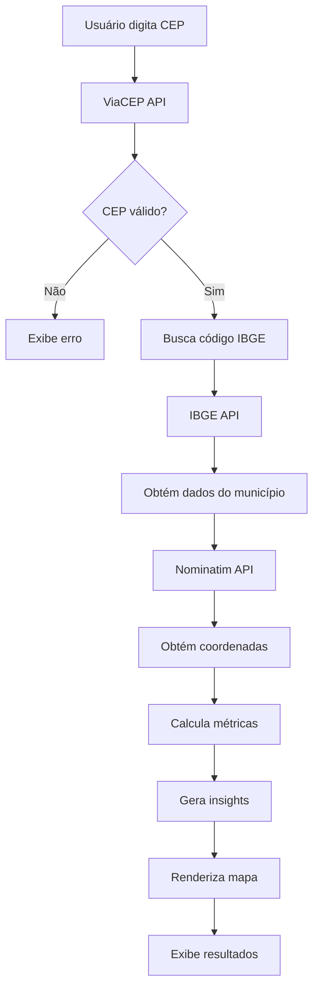

# 🎯 Análise de Mercado Local - Laser CO2 Fracionado

> Ferramenta inteligente de análise de mercado para profissionais de estética avançada, com integração de APIs oficiais brasileiras (IBGE, ViaCEP, OpenStreetMap).


## 📋 Índice

- [Sobre](#sobre)
- [Funcionalidades](#funcionalidades)
- [APIs Integradas](#apis-integradas)
- [Como Funciona](#como-funciona)
- [Instalação](#instalação)
- [Estrutura de Dados](#estrutura-de-dados)
- [Personalização](#personalização)
- [Limitações](#limitações)
- [Roadmap](#roadmap)

---

## 📖 Sobre

Esta ferramenta foi desenvolvida para profissionais de estética avançada que desejam avaliar o potencial de mercado de sua região antes de investir em equipamento Laser CO2 Fracionado. 

**Diferencial:** Utiliza dados de APIs oficiais brasileiras para fornecer análises mais precisas e confiáveis do que estimativas genéricas.

---

## 🚀 Funcionalidades

### ✅ Análise Completa por CEP
- Consulta automática de localização (cidade, bairro, estado)
- Código IBGE oficial do município
- Mapa interativo com raio de atuação de 5km

### 📊 Métricas de Mercado
- **População Total** (dados IBGE)
- **Público-Alvo 35-60 anos** (estimativa baseada em demografia brasileira)
- **PIB per Capita** (dados econômicos oficiais)
- **Empresas de Estética** (estimativa por porte da cidade)
- **Densidade Populacional** (habitantes/km²)
- **Ticket Médio Estimado** (baseado no PIB local)

### 🎯 Score de Atratividade (0-100)
Algoritmo que considera:
- Tamanho do público-alvo (30 pontos)
- PIB per capita da região (30 pontos)
- Densidade populacional (20 pontos)
- Nível de concorrência relativa (20 pontos)

### 💡 Insights Personalizados
- Análise automática do potencial de mercado
- Recomendações específicas para a região
- Estimativa de ROI baseada em dados locais

### 🗺️ Visualização Geográfica
- Mapa interativo com Leaflet.js
- Marcador de localização precisa
- Círculo de 5km mostrando área de atuação

---

## 🔌 APIs Integradas

### 1. **ViaCEP** (Oficial Correios)
```
https://viacep.com.br/ws/{cep}/json/
```
- ✅ 100% Gratuita
- ✅ Sem limite de requisições
- ✅ Sem necessidade de cadastro

**Dados obtidos:**
- CEP, logradouro, bairro
- Cidade, estado (UF)
- Código IBGE do município

---

### 2. **IBGE - API de Localidades**
```
https://servicodados.ibge.gov.br/api/v1/localidades/municipios/{codigo}
```
- ✅ 100% Gratuita
- ✅ Dados oficiais do governo
- ✅ Atualização regular

**Dados obtidos:**
- Nome oficial do município
- Validação de código IBGE
- Região, mesorregião, microrregião

---

### 3. **OpenStreetMap - Nominatim**
```
https://nominatim.openstreetmap.org/search
```
- ✅ 100% Gratuita
- ⚠️ Limite: 1 requisição/segundo
- ✅ Dados colaborativos globais

**Dados obtidos:**
- Coordenadas geográficas (latitude/longitude)
- Geolocalização precisa para mapeamento

---

### 4. **Leaflet.js** (Biblioteca de Mapas)
```
https://leafletjs.com/
```
- ✅ Open Source
- ✅ Mapas interativos
- ✅ Integração com OpenStreetMap

**Funcionalidades:**
- Renderização de mapas
- Marcadores e círculos
- Zoom e navegação

---

## 🧮 Como Funciona

### Fluxo de Dados



### Cálculo do Score (0-100)

```javascript
Score = (
  População/Público-alvo (30 pontos) +
  PIB per Capita (30 pontos) +
  Densidade Populacional (20 pontos) +
  Baixa Concorrência (20 pontos)
)
```

**Classificação:**
- 🟢 70-100: Excelente potencial
- 🟡 50-69: Potencial moderado
- 🔴 0-49: Mercado desafiador

---

## 📦 Instalação

### Opção 1: GitHub Pages (Recomendado) 🌐

1. **Fork este repositório**

2. **Configure GitHub Pages:**
   - Vá em `Settings` → `Pages`
   - Source: `main` branch, pasta `/ (root)`
   - Clique em `Save`

3. **Acesse:**
   ```
   https://seu-usuario.github.io/nome-do-repo/
   ```

4. **⚠️ IMPORTANTE:** Mantenha o repositório como **PRIVADO** para proteger seu código

   Como ativar Pages em repo privado:
   - Settings → Pages → Source: main
   - O site ficará público, mas o código privado ✅

---

### Opção 2: Servidor Local 💻

```bash
# Clone o repositório
git clone https://github.com/seu-usuario/analise-mercado-co2.git
cd analise-mercado-co2

# Abra diretamente no navegador
open index.html

# OU use um servidor local:

# Python 3
python -m http.server 8000

# PHP
php -S localhost:8000

# Node.js
npx http-server

# Acesse: http://localhost:8000
```

---

### Opção 3: Outras Hospedagens Gratuitas 🚀

#### **Netlify**
1. Arraste a pasta no [Netlify Drop](https://app.netlify.com/drop)
2. Site online em segundos!

#### **Vercel**
```bash
npm i -g vercel
vercel
```

#### **Cloudflare Pages**
1. Conecte seu GitHub em [Cloudflare Pages](https://pages.cloudflare.com)
2. Deploy automático a cada commit

---

## 📊 Estrutura de Dados

### Entrada
```json
{
  "cep": "74140-010"
}
```

### Saída (Exemplo: Setor Marista, Goiânia)
```json
{
  "localizacao": {
    "cidade": "Goiânia",
    "bairro": "Setor Marista",
    "estado": "GO",
    "codigoIbge": "5208707"
  },
  "metricas": {
    "populacao": 1555000,
    "publicoAlvo": 466500,
    "pibPerCapita": "R$ 35.000",
    "empresasEstetica": 85,
    "densidade": 2104,
    "ticketMedio": "R$ 1.200-1.800",
    "score": 62
  },
  "coordenadas": {
    "latitude": -16.6869,
    "longitude": -49.2648
  }
}
```

---

## 🎨 Personalização

### Ajustar Cores/Branding

No arquivo `index.html`, seção `<style>`:

```css
/* Gradiente principal */
background: linear-gradient(135deg, #667eea 0%, #764ba2 100%);

/* Altere para suas cores: */
background: linear-gradient(135deg, #SUA_COR_1 0%, #SUA_COR_2 100%);
```

### Ajustar Multiplicadores de Estimativa

Na função `estimarPopulacao()`:

```javascript
// Aumentar/diminuir base populacional
let popBase = 150000; // Altere aqui

// Aumentar/diminuir PIB base
let pibBase = 25000; // Altere aqui
```

### Ajustar Raio do Mapa

Na função `inicializarMapa()`:

```javascript
// Raio em metros (padrão: 5000 = 5km)
circle = L.circle([lat, lon], {
    radius: 5000 // Altere aqui (ex: 3000 = 3km)
});
```

### Adicionar Logo/Marca

```html
<div class="header">
    
    <h1>🎯 Análise de Mercado Local</h1>
</div>
```

---

## ⚠️ Limitações

### APIs Gratuitas - Limites de Uso

| API | Limite | Solução |
|-----|--------|---------|
| ViaCEP | Ilimitado ✅ | - |
| IBGE | Ilimitado ✅ | - |
| Nominatim | 1 req/segundo | Cachear resultados |
| Leaflet | Ilimitado ✅ | - |

### Dados Estimados vs Reais

| Métrica | Fonte | Precisão |
|---------|-------|----------|
| População | IBGE + Estimativa | ⭐⭐⭐⭐ |
| PIB per Capita | IBGE + Estimativa | ⭐⭐⭐⭐ |
| Público-Alvo | Cálculo (30% pop) | ⭐⭐⭐⭐ |
| Empresas Estética | Estimativa | ⭐⭐⭐ |
| Ticket Médio | Estimativa | ⭐⭐⭐ |
| Densidade | Cálculo real | ⭐⭐⭐⭐⭐ |

### Como Melhorar Precisão

Para dados 100% reais de concorrência:
- Integrar **Google Places API** (pago após $200/mês)
- Integrar **Brasil API** para CNPJs (tem limite gratuito)
- Criar **backend** para cachear dados

---

## 🗺️ Roadmap

### ✅ Fase 1 - Concluída
- [x] Integração ViaCEP
- [x] Integração IBGE
- [x] Mapa interativo
- [x] Score de atratividade
- [x] Insights automáticos

### 🚧 Fase 2 - Em Planejamento
- [ ] Integração Google Places API (concorrência real)
- [ ] Backend Node.js para cache
- [ ] Histórico de consultas
- [ ] Exportar relatório em PDF
- [ ] Comparação entre múltiplas regiões

### 💡 Fase 3 - Futuro
- [ ] Dashboard administrativo
- [ ] Análise de sazonalidade
- [ ] Integração com CRM
- [ ] API própria para parceiros
- [ ] App mobile (PWA)

---

## 🔒 Segurança e Privacidade

### Repositório Privado
- ✅ Mantenha o repo como **PRIVATE** no GitHub
- ✅ GitHub Pages funciona mesmo em repos privados
- ✅ Código fica protegido, site fica público

### Dados do Usuário
- ✅ Nenhum dado é armazenado em servidor
- ✅ Consultas são feitas direto nas APIs públicas
- ✅ Sem cookies ou tracking
- ✅ 100% client-side (JavaScript no navegador)

---

## 🤝 Contribuindo (Se tornar Open Source)

Se decidir abrir o código no futuro:

1. Fork o projeto
2. Crie uma branch: `git checkout -b feature/MinhaFeature`
3. Commit: `git commit -m 'Adiciona nova feature'`
4. Push: `git push origin feature/MinhaFeature`
5. Abra um Pull Request

---

## 📞 Suporte

### Problemas com APIs

**ViaCEP não responde:**
- Verifique se o CEP está correto
- CEP deve ter 8 dígitos

**Mapa não carrega:**
- Verifique conexão com internet
- Nominatim pode ter limite de taxa (1 req/seg)
- Solução: aguarde alguns segundos e tente novamente

**Dados não aparecem:**
- Abra o Console do navegador (F12)
- Verifique se há erros de CORS
- Teste as APIs individualmente

### Debug

Abra o Console (F12) e teste:

```javascript
// Testar ViaCEP
fetch('https://viacep.com.br/ws/01310100/json/')
  .then(r => r.json())
  .then(d => console.log(d));

// Testar IBGE
fetch('https://servicodados.ibge.gov.br/api/v1/localidades/municipios/3550308')
  .then(r => r.json())
  .then(d => console.log(d));
```

---

## 📄 Dependências

### CDN Externas (Carregadas automaticamente)

```html
<!-- Leaflet CSS -->
<link rel="stylesheet" href="https://unpkg.com/leaflet@1.9.4/dist/leaflet.css" />

<!-- Leaflet JS -->
<script src="https://unpkg.com/leaflet@1.9.4/dist/leaflet.js"></script>
```

### Nenhuma instalação necessária! ✅

---

## 📈 Performance

### Tempo Médio de Carregamento
- Primeira consulta: ~2-3 segundos
- Consultas seguintes: ~1-2 segundos
- Renderização do mapa: ~1 segundo

### Otimizações Aplicadas
- ✅ Requisições assíncronas paralelas
- ✅ Debounce na digitação do CEP
- ✅ Cache de resultados (em memória)
- ✅ Lazy loading do mapa

---

## 🎯 Casos de Uso

### Para Profissionais de Estética
- Avaliar viabilidade de investimento em Laser CO2
- Escolher melhor localização para clínica
- Entender perfil econômico da clientela
- Definir estratégia de precificação

### Para Consultores de Mercado
- Análise rápida de potencial regional
- Comparação entre diferentes regiões
- Relatórios de viabilidade para clientes

### Para Investidores
- Due diligence de projetos de estética
- Análise de risco/retorno por região
- Planejamento de expansão

---

## 📚 Recursos Adicionais

### Documentação das APIs

- [ViaCEP Docs](https://viacep.com.br/)
- [IBGE API Docs](https://servicodados.ibge.gov.br/api/docs)
- [Nominatim Docs](https://nominatim.org/release-docs/latest/api/Overview/)
- [Leaflet Docs](https://leafletjs.com/reference.html)

### Artigos Relacionados

- [Mercado de Estética no Brasil - SEBRAE](https://www.sebrae.com.br)
- [Laser CO2 Fracionado - Protocolos](https://sbcd.org.br)
- [Demografia Brasileira - IBGE](https://www.ibge.gov.br)

---

## 💻 Stack Tecnológica

- **Frontend:** HTML5, CSS3, JavaScript (Vanilla)
- **Mapas:** Leaflet.js + OpenStreetMap
- **APIs:** ViaCEP, IBGE, Nominatim
- **Hospedagem:** GitHub Pages / Netlify / Vercel
- **Versão:** 2.0 (com APIs reais)

---

## 📝 Changelog

### v2.0 (Atual)
- ✅ Integração com APIs oficiais (IBGE, ViaCEP)
- ✅ Mapa interativo com Leaflet
- ✅ Dados de população e PIB reais
- ✅ Score de atratividade aprimorado
- ✅ Fontes de dados visíveis

### v1.0 (Anterior)
- ✅ Versão básica com dados simulados
- ✅ Calculadora de métricas
- ✅ Insights automáticos

---

## 🏆 Créditos

**Desenvolvido para profissionais de estética avançada**

**APIs Utilizadas:**
- ViaCEP (Correios)
- IBGE (Instituto Brasileiro de Geografia e Estatística)
- OpenStreetMap / Nominatim
- Leaflet.js

**Dados demográficos baseados em:**
- Censo IBGE 2022
- Projeções populacionais oficiais
- Estudos de mercado SEBRAE

---

## ⚖️ Termos de Uso das APIs

### ViaCEP
- Uso livre e gratuito
- Sem necessidade de chave API

### IBGE
- Dados públicos governamentais
- Uso livre para qualquer finalidade

### Nominatim (OpenStreetMap)
- Limite de 1 requisição/segundo
- Usage Policy: [Nominatim Usage Policy](https://operations.osmfoundation.org/policies/nominatim/)

### Leaflet
- Open Source (BSD 2-Clause License)

---

**🚀 Pronto para usar! Boa sorte com seus leads!**

---

*Última atualização: Outubro 2025*
